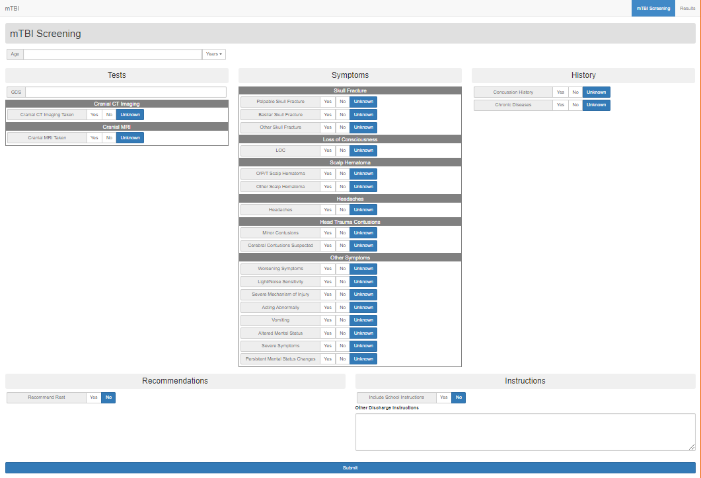
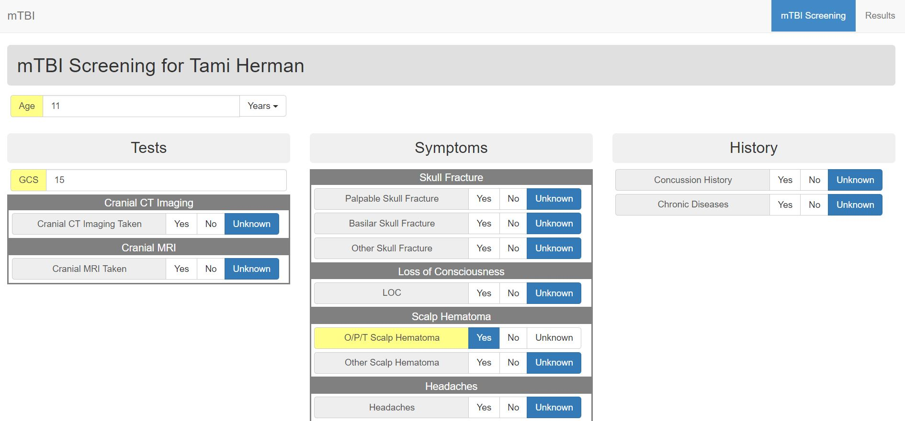
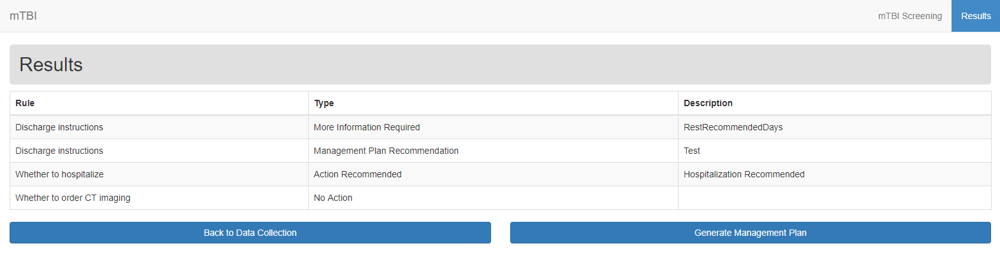

# User Guide

## Launch

If you haven't already done so, please install the app using the instructions in the [Installation](../installation/README.md) section. Once this is done, navigate to http://localhost:8083 in a web browser to launch the app.

## Data Collection

On launch, the app displays the data collection view to receive input for the CDS system. Data fields consist of number inputs (for example, the Age and GCS fields), tri-state inputs (allowing for Yes, No, and Unknown responses), and a free-text field for custom discharge instructions.

Some additional inputs only display once other relevant inputs have been filled. For example, the LOC Time field only displays once the user has indicated that LOC has occurred by choosing Yes on the LOC field.

Future work will enable some of this data to be retrieved via FHIR from the EHR which launches the app. These values will be highlighted in yellow to indicate they were obtained automatically and should be checked, as shown in the following screenshot. All values in the data collection view can be changed prior to submission regardless of their source.

After data has been entered, press the Submit button. When results are returned from the server's CDS logic, you are automatically redirected to the results view.

## Results

This view displays the output of the CDS logic rules. Each row in the table represents one rule. The title of the rule is displayed in the first column. The second column shows one of the following for each rule:

* **No Action**: The rule has not recommended any actions.
* **Error**: An error occurred in the CDS rule.
* **More Information Required**: The rule requests more information which can be entered on the Data Collection view. Requested data fields are marked with an exclamation point.
* **Action Recommended**: The rule recommends an action be taken, such as a diagnostic image or hospitalization.
* **Management Plan Recommendation**: The rule has added recommendations to the management plan.

The content of the third column is dependent on the type of rule output. For an action recommendation, the column shows the recommended action. When more information is required, the column shows which fields are needed for the rule to complete. If an error occurs, the column shows the error message.

## Next Steps

Depending on the rule output, you can use the Back to Data Collection button to enter more data or click the Generate Management Plan button to download the auto-generated management plan as a Microsoft Word document. This document contains special instructions based on entered data as well as the custom discharge instructions entered in the Data Collection view.
